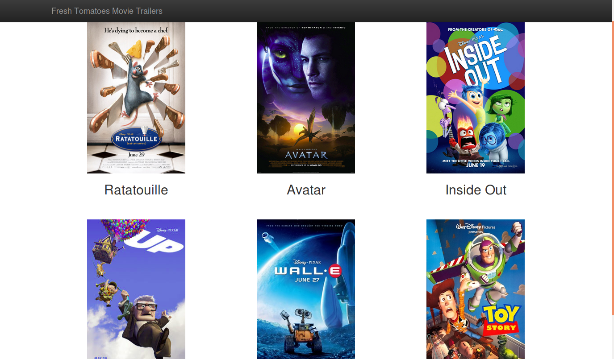

# Udacity Fullstack developer Nanodegree ud036
Source code for a Movie Trailer website.

# Steps
1. Install [Python](https://www.python.org/)
1. Clone the repository using `git clone https://github.com/manikandants/ud036_StarterCode.git`
1. Navigate to the directory `cd <dirname>`
1. Execute the program using `python entertainment_center.py`

# Files
* .gitignore - To ignore the compiled files from the git repository
* entertainment_center.py - Creates the list of movie objects for displaying in web page
* fresh_tomatoes.html - Movies webpage created by fresh_tomatoes.py
* fresh_tomatoes.py - Creates the Movies webpage
* media.py - Movie class definition and constructor
* Readme.md - Documentation file

# Screenshot
